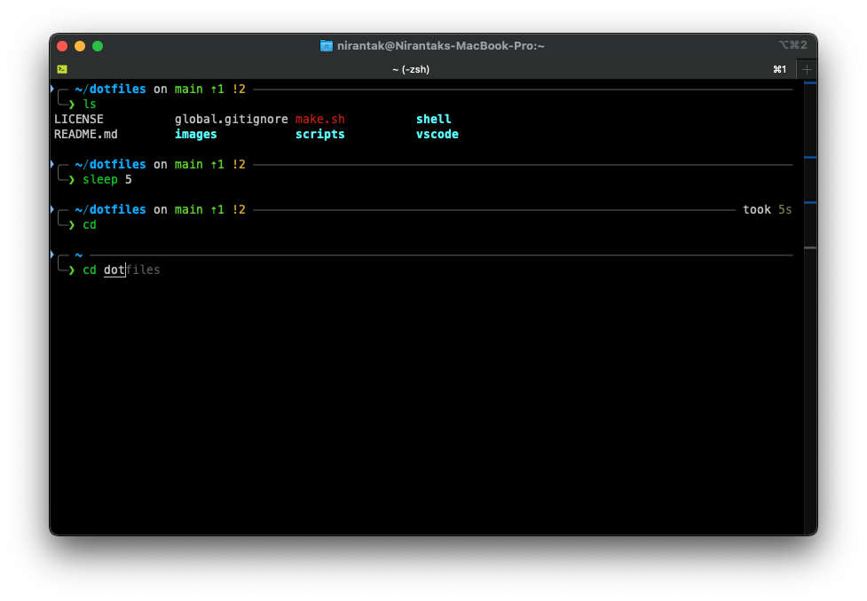
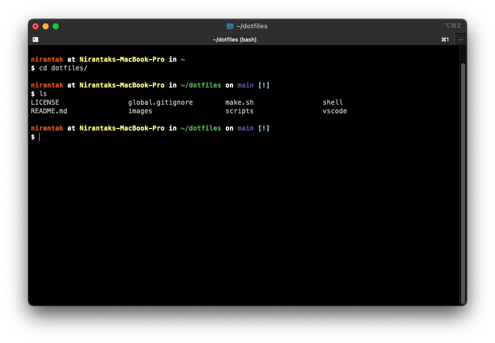
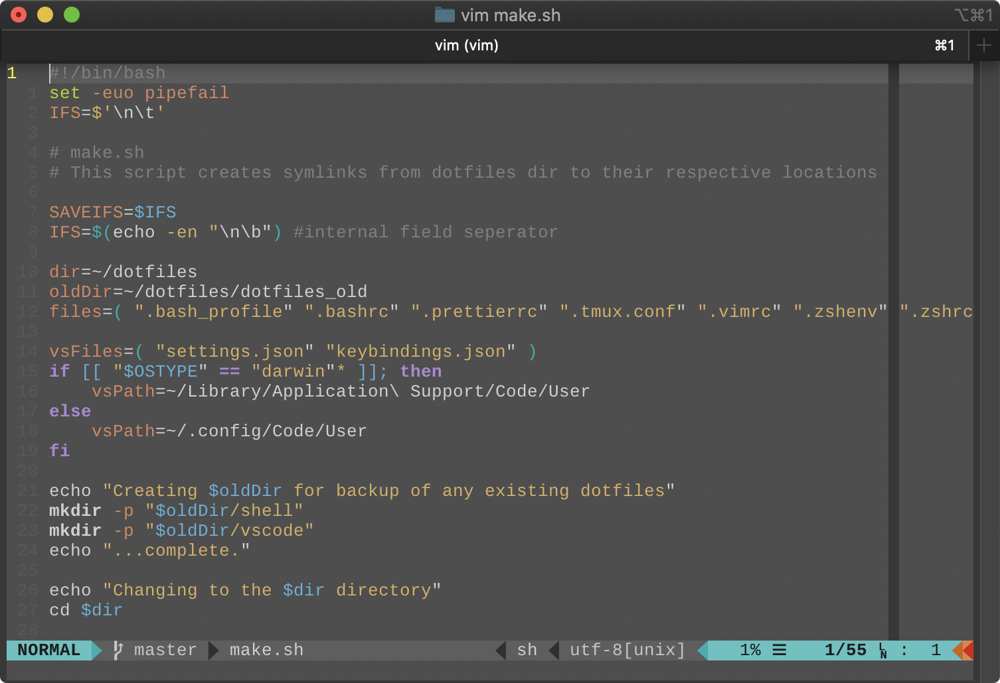

# Dotfiles

> _Configuration files for zsh, bash, vim, tmux, git, Sublime Text 3, and VSCode_

### Table of Contents

- [Dotfiles](#dotfiles)
    - [Table of Contents](#table-of-contents)
    - [Installation](#installation)
    - [Screenshots](#screenshots)
    - [References](#references)

### Installation

Install necessary dependencies

```bash
$ sudo apt update && sudo apt install -y git curl wget vim zsh tmux
$ # or for full system setup:
$ ./scripts/bootstrap_ubuntu.sh
```

Clone the git repository:

```bash
$ git clone https://github.com/nirantak/dotfiles.git ~/dotfiles
```

Install additional software

-   [Sublime Text 3](https://www.sublimetext.com/3)
-   [Visual Studio Code](https://code.visualstudio.com/Download)
-   [Oh-my-zsh](https://github.com/robbyrussell/oh-my-zsh)
-   [Vundle](https://github.com/VundleVim/Vundle.vim)
-   [Powerline](https://github.com/powerline/powerline)
-   [Powerline Fonts](https://github.com/powerline/fonts)
-   [powerlevel9k](https://github.com/bhilburn/powerlevel9k)
-   [zsh-autosuggestions](https://github.com/zsh-users/zsh-autosuggestions)
-   [zsh-syntax-highlighting](https://github.com/zsh-users/zsh-syntax-highlighting)

Run the setup script

```bash
$ bash ~/dotfiles/make.sh
```

Old dotfiles are backed up in `~/dotfiles/dotfiles_old`

### Screenshots

-   Zsh



-   Bash



-   Vim



### References

-   [GitHub dotfiles](http://dotfiles.github.io/)
-   [Mathias Bynens'](https://github.com/mathiasbynens/dotfiles) dotfiles
